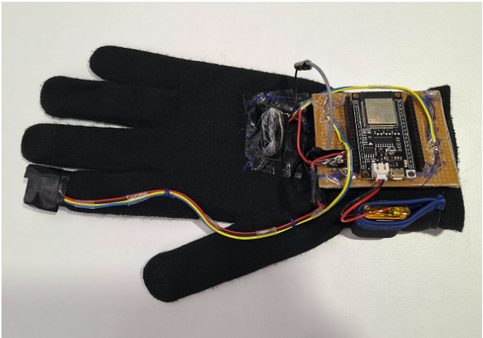
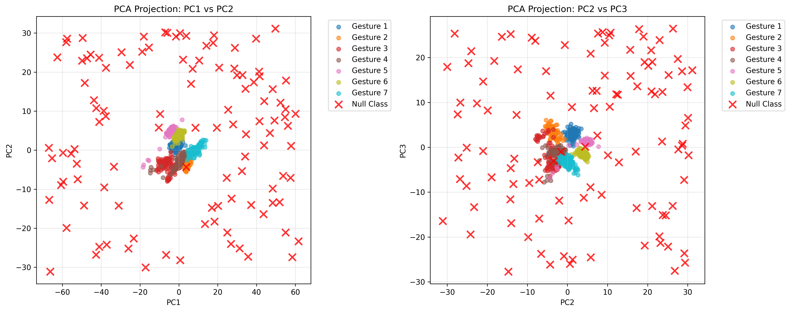

# 🧤 Presentation Control Glove with IMU-based Real-time Gesture Recognition and FPGA Acceleration

> A complete end-to-end system for real-time hand gesture recognition using dual IMU sensors, deployed on FPGA hardware for ultra-low latency inference. This includes code used in data collection, preprocessing, training on Google Colab and files needed to create IP block to run inference on FPGA.

[](LICENSE)
[](https://www.python.org/)
[](https://www.kaggle.com/datasets/suveenellawela/hand-gesture-classification-2-imu-glove)

This is one of the capstone projects under National University of Singapore course CG4002.



Watch the system in action controlling a presentation:

https://github.com/user-attachments/assets/d4b98293-3bb8-4b1d-89e3-794cf29e6228

## 🎯 Overview

This project implements a real-time gesture recognition system using data from two IMU (Inertial Measurement Unit) sensors - one on the wrist and one on the index finger. The system:

- Captures 6-axis IMU data (3-axis accelerometer + 3-axis gyroscope) from 2 sensors
- Extracts 84 hand-crafted features from 1-second windows
- Classifies gestures using a Multi-Layer Perceptron (MLP) neural network
- Achieves **sub 3 ms inference time** on FPGA hardware (Xilinx Ultra96/ZCU104)
- Recognizes **8 gesture classes** with **99% accuracy**

### Supported Gestures

See the gesture guide video for visual demonstrations of each gesture:

https://github.com/user-attachments/assets/b3b03278-9d59-4526-8d9c-4a84b0b6c4f9

- 0 - NONE
- 1 - SLIDE_LEFT
- 2 - SLIDE_RIGHT
- 3 - WRIST_TURN_CLOCKWISE
- 4 - WRIST_TURN_ANTI_CLOCKWISE
- 5 - SLIDE_UP
- 6 - SLIDE_DOWN
- 7 - SHAKE

## 📁 Repository Structure

```
presentation-control-glove/
├── data/                              # Dataset files
│   └── preprocessed_dataset.csv      # Preprocessed feature dataset (1388 samples)
│
├── model/                             # Trained model artifacts
│   ├── model_info.json               # Model metadata and performance metrics
│   ├── scaler.pkl                    # StandardScaler for feature normalization
│   ├── mlp_weights.h                 # C header with model weights
│   ├── mlp_test_data.h              # Test data for validation
│   ├── weights_npy/                  # NumPy weight files
│   │   ├── dense_64_W.npy           # Layer 1 weights (84×64)
│   │   ├── dense_64_b.npy           # Layer 1 biases
│   │   ├── dense_32_W.npy           # Layer 2 weights (64×32)
│   │   ├── dense_32_b.npy           # Layer 2 biases
│   │   ├── logits_W.npy             # Output layer weights (32×8)
│   │   └── logits_b.npy             # Output layer biases
│   └── io_npy/                       # Test input/output data
│       ├── test_x.npy                # Test features
│       └── test_y.npy                # Test labels
│
├── notebooks/                         # Jupyter notebooks
│   ├── train_mlp_model.ipynb        # Model training pipeline
│   └── load_and_test_model.ipynb    # Load and evaluate trained model
│
├── src/                               # Python source code
│   ├── data_collection.py            # IMU data collection scripts
│   ├── preprocess.py                 # Feature extraction (84 features)
│   ├── segment_gestures.py           # Gesture segmentation from streams
│   └── extract_weights.py            # Convert model to C headers
│
└── hardware/                          # FPGA/embedded implementation
    ├── mlp_model.cpp                 # C++ inference implementation
    ├── mlp_model.h                   # C++ header
    ├── mlp_model_test.cpp            # C++ test harness
    ├── mlp_weights.h                 # Model weights (C header)
    ├── mlp_test_data.h               # Test data (C header)
    └── bitstream/                    # FPGA bitstream files
        └── mlp.xsa                   # Xilinx System Archive
```

### Installation

1. **Clone the repository**
```bash
git clone https://github.com/SuveenE/presentation-control-glove.git
cd presentation-control-glove
```

2. **Install Python dependencies**
```bash
python3 -m venv venv
source venv/bin/activate  # On Windows: venv\Scripts\activate
pip3 install -r requirements.txt
```

## 📊 Dataset and Data Format

### Dataset
The training dataset is available on [Kaggle](https://www.kaggle.com/datasets/suveenellawela/hand-gesture-classification-2-imu-glove).

**Dataset Statistics:**
- Total gesture windows: 1,388
- Classes: 8 (7 gestures + null/none class)
- Sampling rate: ~30 Hz
- Window duration: 1 second
- Train/Test split: 80/20

### Raw IMU Data Format

Each gesture sample is stored as a CSV file with the following structure:

**Columns (13 total):**
```
timestamp, 
Imu0_linear_accleration_x, Imu0_linear_accleration_y, Imu0_linear_accleration_z,
Imu0_angular_velocity_x, Imu0_angular_velocity_y, Imu0_angular_velocity_z,
Imu1_linear_accleration_x, Imu1_linear_accleration_y, Imu1_linear_accleration_z,
Imu1_angular_velocity_x, Imu1_angular_velocity_y, Imu1_angular_velocity_z
```


## 🧠 Model Details

### Architecture
```
Input (84) → Dense(64, ReLU) → Dense(32, ReLU) → Dense(8, Softmax)
```

### Feature Engineering (84 features)
- **Per-IMU features (40 × 2 = 80)**:
  - Axis statistics (5 stats × 3 axes × 2 signals): mean, std, RMS, max, median
    - 3 accel axes (x, y, z)
    - 3 gyro axes (x, y, z)
  - Magnitude statistics (5 stats × 2 magnitudes): accel magnitude, gyro magnitude

- **Cross-IMU features (4)**:
  - Acceleration magnitude correlation (wrist ↔ finger)
  - Gyroscope magnitude correlation (wrist ↔ finger)
  - RMS ratio: finger accel / wrist accel
  - RMS ratio: finger gyro / wrist gyro

Null class data was generated using a PCA based approach. See the visualization below:




## ⚡ Hardware Deployment (FPGA)

The model is deployed on Xilinx FPGA for ultra-low latency inference. The repository includes:
- **C++ implementation** (`mlp_model.cpp/.h`) - Pure C++ inference without dependencies
- **Pre-compiled bitstream** (`hardware/bitstream/`) - Ready to deploy on PYNQ boards
- **Test harness** (`mlp_model_test.cpp`) - Validates C++ implementation against known outputs

## 📝 Citation

If you use this work in your research or project, please cite:

```bibtex
@software{presentation_glove_imu_2025,
  author = {Suveen Ellawela},
  title = {Presentation Control Glove with IMU-based Real-time Gesture Recognition and FPGA Acceleration},
  year = {2025},
  url = {https://github.com/SuveenE/presentation-control-glove},
  note = {Dataset: https://www.kaggle.com/datasets/suveenellawela/hand-gesture-classification-2-imu-glove}
}
```

## 📄 License

This project is licensed under the MIT License. See LICENSE file for details.

## 🙏 Acknowledgments

- Dataset collected as part of CG4002 Computer Engineering Capstone Project, NUS
- My project groupmates 
- Teaching staff of the course

## 📧 Contact

- **Twitter**: https://x.com/SuveenE
- **Email**: suveen.te1[at]gmail.com

---
